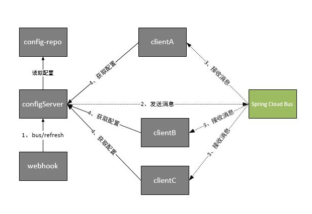

## 背景情况
我们将一个工程，部署到一台机器上运行后，实际上该工程就可以对外提供服务了，但是如果部署服务的机器坏掉后，服务也就不可使用（单点），为了保证服务持续有效，我们会把服务部署到多台机器上，任一台机器坏掉，并不影响其他机器提供服务（集群），偶尔有时候某一个小功能需要上线更新，但又不想使整个服务启停，我们又将把各个服务单独拆分了出来（微服务）；在保证服务越来越好的情况下，我们一个服务所使用的机器也越来越多，比如我们在100台机器的集群环境中部署了短信服务，而短信服务所使用的数据库端口为`3306`，有一天由于数据库升级，端口更改为了`3307`,这时候我们要做的事情，就是在这一百台机器中，将数据库连接的端口每一台都修改为`3307`，简直是要了人老命。。。而在spring cloud的解决方案则是有一个分布式的配置中心，来管理所有服务的配置，从而实现一处更改，多处更新。
## 什么是分布式配置中心
Spring Cloud Config为分布式系统中的外部配置提供服务器和客户端支持。使用Config Server，您可以在所有环境中管理应用程序的外部属性。客户端和服务器上的概念映射与Spring Environment和PropertySource抽象相同，因此它们与Spring应用程序非常契合，但可以与任何以任何语言运行的应用程序一起使用。随着应用程序通过从开发人员到测试和生产的部署流程，您可以管理这些环境之间的配置，并确定应用程序具有迁移时需要运行的一切。服务器存储后端的默认实现使用git，因此它轻松支持标签版本的配置环境，以及可以访问用于管理内容的各种工具。很容易添加替代实现，并使用Spring配置将其插入。
## 实现一个简单的配置中心
Spring Boot 版本为：`1.5.13.RELEASE`，Spring Cloud版本为：`Dalston.SR5`。（这里为什么要特别注明版本？因为Spring Boot2.x版本后的配置中心与1.5x版本不一样）
### 新建一个ConfigServer
#### pom.xml

	<!-- 声明该工程需要使用配置中心服务功能 -->
	<dependency>
	    <groupId>org.springframework.cloud</groupId>
	    <artifactId>spring-cloud-starter-config</artifactId>
	</dependency>
	
	<!--configServer所需依赖  -->
	<dependency>
	    <groupId>org.springframework.cloud</groupId>
	    <artifactId>spring-cloud-config-server</artifactId>
	</dependency>

#### bootstrap.yml

	
	spring:
	  application:
	    name: config
	  profiles:
	    active: native  # 配置使用本地储存
	  cloud:
	    config:
	      server:
	        native:
	          search-locations: file:E:\\gitProjects\\spring-cloud\\springcloud-config\\config\\src\\main\\resources\\properties  # 搜索目录下的properties文件夹下的文件
	server:
	  port: 7000

> `search-locations`中为什么不用`classpath:properties/`？因为使用classpath的方式配置中心服务端无法做到及时更新。
> 为什么使用`bootstrap.yml`而不使用`application.yml`？因为`bootstrap.yml`会先于`application.yml`加载。
> `active`有native，git，svn三种方式；

该目录下有一个`mail-service-dev.yml`配置文件，内容是：

	name: cxy
	spring:
	  datasource:
	    driver-class-name: com.mysql.jdbc.Driver
	#    url: jdbc:mysql://10.8.5.100:3306/acmtc
	    url: jdbc:mysql://10.8.3.40:3306/acmtc
	    username: root
	    password: root

> 配置文件命名规则：
> /{application}/{profile}[/{label}]
> /{application}-{profile}.yml
> /{label}/{application}-{profile}.yml
> /{application}-{profile}.properties
> /{label}/{application}-{profile}.properties

#### App.java

	@SpringBootApplication
	@EnableConfigServer        // 声明是配置中心服务端
	public class App{
	    public static void main( String[] args ){
	        SpringApplication.run(App.class, args);
	    }
	}

启动`App.java`，访问`http://localhost:7000/mail-service/dev`，可以看到配置信息：
	
	{
	  "name": "mail-service",
	  "profiles": [
	    "dev"
	  ],
	  "label": null,
	  "version": null,
	  "state": null,
	  "propertySources": [
	    {
	      "name": "file:E://gitProjects//spring-cloud//springcloud-config//config//src//main//resources//properties/mail-service-dev.yml",
	      "source": {
	        "name": "cxy",
	        "spring.datasource.driver-class-name": "com.mysql.jdbc.Driver",
	        "spring.datasource.url": "jdbc:mysql://10.8.3.40:3306/acmtc",
	        "spring.datasource.username": "root",
	        "spring.datasource.password": "root"
	      }
	    }
	  ]
	}

### 新建一个ConfigClient

#### pom.xml

	
	<!-- 告诉spring cloud这个工程以web方式运行 -->
	<dependency>
	    <groupId>org.springframework.boot</groupId>
	    <artifactId>spring-boot-starter-web</artifactId>
	</dependency>
	
	<!-- 声明该工程需要使用配置中心服务功能 -->
	<dependency>
	    <groupId>org.springframework.cloud</groupId>
	    <artifactId>spring-cloud-starter-config</artifactId>
	</dependency>
	
	<!-- 连接数据库的基本功能 -->
	<dependency>
	    <groupId>org.springframework.boot</groupId>
	    <artifactId>spring-boot-starter-jdbc</artifactId>
	</dependency>
	
	<dependency>
	    <groupId>mysql</groupId>
	    <artifactId>mysql-connector-java</artifactId>
	    <scope>runtime</scope>
	</dependency>

#### bootstrap.yml

	spring:
	  application:
	    name: mail-service
	  cloud:
	    config:
	      uri: http://localhost:7000/
	      profile: dev
	server:
	  port: 8000

#### App.java
	
	@SpringBootApplication
	@RestController
	public class App{
	    public static void main( String[] args )
	    {
	        SpringApplication.run(App.class, args);
	    }
	
	    @Autowired
	    private Environment environment;
	
	    @Autowired
	    private JdbcTemplate jdbcTemplate;
	
	    @RequestMapping(value = "/hi", method = RequestMethod.GET)
	    @RefreshScope
	    public String hi(){
	        return "Hello "+ environment.getProperty("name");
	    }
	
	    @RequestMapping(value = "/hiDb", method = RequestMethod.GET)
	    public String hiDb(){
	        List<User> list = jdbcTemplate.query("select * from user",new Object[]{},new BeanPropertyRowMapper(User.class));
	        String account = "";
	        if(list!=null&& list.size()>0){
	            account = list.get(0).getAccount();
	        }
	        return "Hello "+ account;
	    }
	}

#### DataSourceConfig.java

	@Configuration// 配置数据源
	public class DataSourceConfig {
	
		@Bean
		@ConfigurationProperties(prefix = "spring.datasource") // 数据源的自动配置的前缀
		public DataSource dataSource() {
			return DataSourceBuilder.create().build();
		}
	}

#### User.java

	public class User {
		private String id;
		private String account;
	
		public String getId() {
			return id;
		}
	
		public void setId(String id) {
			this.id = id;
		}
	
		public String getAccount() {
			return account;
		}
	
		public void setAccount(String account) {
			this.account = account;
		}
	}

启动App.java，可以在启动日志中看到：

	2018-10-31 11:34:12.782  INFO 15804 --- [           main] c.c.c.ConfigServicePropertySourceLocator : Fetching config from server at: http://localhost:7000/
	2018-10-31 11:34:13.176  INFO 15804 --- [           main] c.c.c.ConfigServicePropertySourceLocator : Located environment: name=mail-service, profiles=[dev], label=null, version=null, state=null
	2018-10-31 11:34:13.177  INFO 15804 --- [           main] b.c.PropertySourceBootstrapConfiguration : Located property source: CompositePropertySource [name='configService', propertySources=[MapPropertySource {name='file:E://gitProjects//spring-cloud//springcloud-config//config//src//main//resources//properties/mail-service-dev.yml'}]]

打开浏览器访问`http://localhost:8000/hi`，则可以看到：`Hello cxy`，其中cxy为`mail-service-dev.yml`中配置的值；
打开浏览器访问`http://localhost:8000/hiDb`，则可以看到：`Hello localhostRoot`，其中`localhostRoot`为`mail-service-dev.yml`中配置的数据库中查到的值；

至此，我们做到了从配置中心读取配置的功能。

## 配置信息动态更新
第一步中将配置信息放到了配置中心，所有服务去配置中心里拿取配置，但是如果配置文件有改动，正常情况应该将每一台机器进行重启，以便重新获取配置信息，但是在微服务中，这明显是个耗时耗力的事情，秉持着能省就省的原则，分布式配置中心可以实现不重启刷新配置。
### ConfigClient
#### pom.xml
在原基础上增加

	<!-- 客户端刷新配置需要用到 -->
	<dependency>
	    <groupId>org.springframework.boot</groupId>
	    <artifactId>spring-boot-starter-actuator</artifactId>
	</dependency>

#### bootstrap.yml
在原基础上增加

	management:
	  security:
	    enabled: false  # 关闭安全校验

#### App.java

	@SpringBootApplication
	@RestController
	@RefreshScope  		//在需要刷新配置的地方，增加@RefreshScope注解
	public class App{
	    public static void main( String[] args )
	    {
	        SpringApplication.run(App.class, args);
	    }
	
	    @Autowired
	    private Environment environment;
	
	    @Autowired
	    private JdbcTemplate jdbcTemplate;
	
	    @RequestMapping(value = "/hi", method = RequestMethod.GET)
	    public String hi(){
	        return "Hello "+ environment.getProperty("name");
	    }
	
	    @RequestMapping(value = "/hiDb", method = RequestMethod.GET)
	    public String hiDb(){
	        List<User> list = jdbcTemplate.query("select * from user",new Object[]{},new BeanPropertyRowMapper(User.class));
	        String account = "";
	        if(list!=null&& list.size()>0){
	            account = list.get(0).getAccount();
	        }
	        return "Hello "+ account;
	    }
	}

#### DataSourceConfig.java

	@Configuration// 配置数据源
	public class DataSourceConfig {
	
		@Bean
		@RefreshScope// 刷新配置文件
		@ConfigurationProperties(prefix = "spring.datasource") // 数据源的自动配置的前缀
		public DataSource dataSource() {
			return DataSourceBuilder.create().build();
		}
	}

启动App.java，在浏览器中访问`http://localhost:8000/hi`，展示`Hello cxy`；
在浏览器中访问`http://localhost:8000/hiDb`，展示`Hello localhostRoot`；
此时我们更改`mail-service-dev.yml`配置文件中的值：

	#name: cxy
	name: cxy32
	spring:
	  datasource:
	    driver-class-name: com.mysql.jdbc.Driver
	    url: jdbc:mysql://10.8.5.100:3306/acmtc
	#    url: jdbc:mysql://10.8.3.40:3306/acmtc
	    username: root
	    password: root

通过POST请求访问`http://localhost:8000/refresh`，得到返回结果：

可以发现返回结果中有本次修改的内容，分别是`spring.datasource.url`和`name`；
此时再次访问`http://localhost:8000/hi`，展示`Hello cxy32`；访问`http://localhost:8000/hiDb`，展示`Hello root`；

至此通过配置中心获取配置并动态刷新配置已经成功，但这种方式仍有缺点，就是需要在每一台客户端中执行refresh请求，继续秉持着能省就省的原则，继续改进；
## Spring Cloud Bus（消息总线）
SpringCloudBus，大家可以将它理解为管理和传播所有分布式项目中的消息既可，其实本质是利用了MQ的广播机制在分布式的系统中传播消息，目前常用的有Kafka和RabbitMQ。利用bus的机制可以做很多的事情，其中配置中心客户端刷新就是典型的应用场景之一。

### ConfigServer
#### pom.xml
在原基础上增加：

	<!-- 消息总线 -->
	<dependency>
	    <groupId>org.springframework.cloud</groupId>
	    <artifactId>spring-cloud-starter-bus-amqp</artifactId>
	</dependency>
	<!--暴露各种指标 -->
	<dependency>
	    <groupId>org.springframework.boot</groupId>
	    <artifactId>spring-boot-starter-actuator</artifactId>
	</dependency>

### bootstrap.yml
在原基础上增加mq配置

	# mq配置
	spring:
	  rabbitmq:
	    host: localhost
	    port: 5672
	    username: guest
	    password: guest
	
	# 测试阶段关闭安全校验
	management:
	  security:
	    enabled: false

### ConfigClient
#### pom.xml
在原基础上增加：

	<!-- 增加消息总线 -->
	<dependency>
	    <groupId>org.springframework.cloud</groupId>
	    <artifactId>spring-cloud-starter-bus-amqp</artifactId>
	</dependency>

启动App.java，在浏览器中访问`http://localhost:8000/hi`，展示`Hello cxy32`；
在浏览器中访问`http://localhost:8000/hiDb`，展示`Hello root`；
此时我们更改`mail-service-dev.yml`配置文件中的值：

	name: cxy
	# name: cxy32
	spring:
	  datasource:
	    driver-class-name: com.mysql.jdbc.Driver
	#    url: jdbc:mysql://10.8.5.100:3306/acmtc
	    url: jdbc:mysql://10.8.3.40:3306/acmtc
	    username: root
	    password: root

通过POST请求访问`http://localhost:7000/bus/refresh`，得到返回结果：

MQ中的消息为：

此时再次访问`http://localhost:8000/hi`，展示`Hello cxy`；访问`http://localhost:8000/hiDb`，展示`Hello localhostRoot`；

至此spring cloud config 分布式配置中心全部完成。
项目地址：[GIT地址](https://github.com/loooSwc/springcloud-config.git)